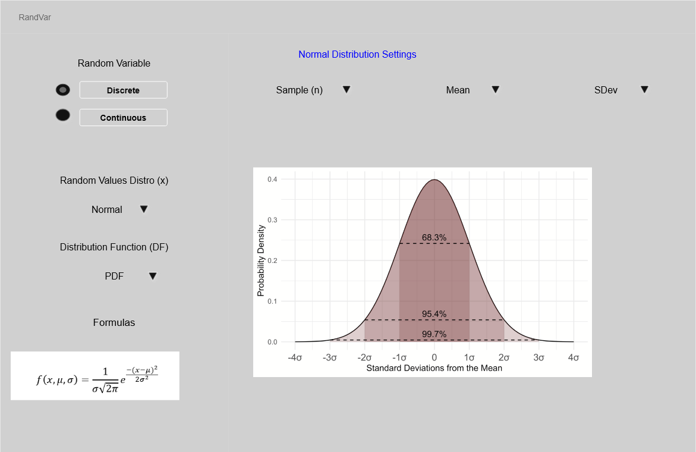
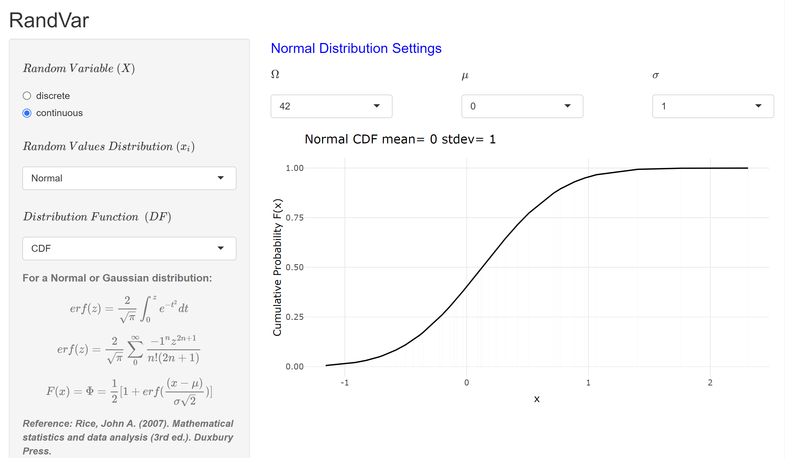

```{r load libraries, echo=FALSE, warning=FALSE, message=FALSE}
#housework
library(utils)
library(pastecs)
library(readxl)
library(readr)
library(vroom)
#tidyverse
library(dplyr)
library(tidyr)
library(broom)
library(janitor)
#plotting
library(rlang)
library(ggplot2)
library(RColorBrewer)
library(ggnormfluodbf)
#stats
library(stats) #shapiro
library(dgof) #kolmogorov
library(car) #levene's
library(rstatix)
library(pwr)
#markdown
library(knitr)
library(kableExtra)
```

\section*{Concept and Purpose}

Program mathematical expressions of random variables, apply the programmed functions unto simulated data sets (vectors or data frames) in what is dubbed function scaling and program visualization of the data. 

\textbf{Random variables (RV)} are functions that map events ($\omega$) in the sample space ($\Omega$) set to a real ($\mathbb{R}$) set of random values ($x_i$). A scenario of $4$ \textbf{coin tosses} produces a set of outcomes that have no inherent meaning at first glance. An attempt to make sense of the coin toss scenario leads to a question like ;How many heads occur before a $1^{st}$ tail? The answer to this question generates a random variable (RV) that assigns a real value ($\mathbb{R}$) to the `number of heads before a first tail`, which can also be symbolized as $X$. Although $X$ is thought of as the random variable, a better way to think about this will be to think of the RV as the function that can facilitate the deduction of $X$. The RV and the function generating the RV can thus be thought of as the same thing, within different context obviously. In the $4$ coin toss example, the function generating the RV for the `number of heads before a first tail` should be considered the RV because with this approach, there is a possibility to account for the RV if the event is $5$ coin tosses or more.

Mapping events ($\omega$) to a real ($\mathbb{R}$) set often entails determining the probability of independent random values ($x_i$), which is achieved via a Probability Mass Function (PMF) or its analog Probability Density Function (PDF). This concept of using a PMF or PDF to represent the probability measure on an event ($\omega$) or sample space ($\Omega$) is at the core of statistical modeling.

Scientists and statisticians have deduced key distribution types paired to PMFs or PDFs that can be used to model different events. Events considered normal will be modeled with a normal PDF and this can be applied to different types of events (exponential, poisson etc.). The shiny app `RandVar` provides a dynamic interactive user interface (UI) to explore how random variables (RV) are modeled and how the parameters of PMFs or PDFs affect the modeled RV through visualizations powered by the `ggplot2` library in R.

\newpage

\section*{Initial Plan/Motivation}

The comprehension of statistical modeling is not straightforward and several questions arise pertaining to the order of steps used in statistical modeling. While there is no one size fits all recipe to understanding statistical modeling, it is important to think in-depth about the topic in order to formulate some best practices for statistical modeling. Some questions to ask include:

- Is an event classified before attempting to model or are models applied to arrive at the event classification?

- How do PMF or PDF parameters affect a statistical model on paper and can perceived differences in the model from parameter tweaks be translated to real life events?

- Are these models even valid representations of real life events?

- What is the difference between events modeled by PMFs vs PDFs?

- Why is the behavior of cumulative probability consistent across different model types and does it hold any weight in the interpretation of statistical analysis?

- What is the history of these distribution types?

Answering any of these questions would prompt the need for an interactive tool to delve deeper into statistical modeling and that is exactly the audience targeted by the development of `RandVar`. A schematic of the app design is provided below:

{ height=420px }

\newpage

\section*{Datasets}

`RandVar` is powered by simulated data. Data for discrete random variables consists of discrete values generate from R's `seq` function; while data for continuous random variables are generate from the respective R functions that generate data relevant to the event type (`rnorm()` for normal, `rexp()` for exponential , and so on). Currently `RandVar` only models the normal distribution as it relates to continuous random variables and future work is anticipated for the addition of more continuous random variables.

\section*{Key Features}

`RandVar` inputs are predominantly PMF or PDF parameters. The key output of `RandVar` is a visual or plot built on the `ggplot2` engine (R graphics language) and `ggplotly`.  The `ggplotly` engine is a key feature for interactivity in the app. This is illustrated here:

{ height=520px }

\newpage

\section*{Server Logic}

`RandVar` is a modular app with simple server logic that is efficient although there is room for improvement. `RandVar` is not bottle necked by a `UI-focus` and so this provides tremendous opportunity for high level server logic implementation and allows room for developers to focus on learning the statistics while implementing it in the app.

The server logic entails generating simulated data that matches the random variable type and distribution type. The data is passed into a function that generates the model by calculating the probability of the independent random values ($x_i$) in accordance with the distribution type PMF or PDF and CDF. The data obtained from the distribution functions is passed into a `ggplot` function, nested within a `ggplotly` function in order to achieve high-level interactivity for the `RandVar` audience. 

\section*{App Relevance}

`RandVar` provides a plug and play playground for users to tweak distribution parameters and observe in real-time how the shape of the distribution changes on the `ggplot2` powered plots. Enhanced interaction allows for the user to hover over the graphs and take a closer look at values to determine if these values match theoretically known values that come from standard tables like the T-table or Z-table. Insights from the app include:

- Observing changes to the binomial distribution when the probability value changes.

- What sample size (n) is suitable for modeling using a binomial distribution?

- Observing changes to the normal distribution when the mean or standard deviation changes.

- Understanding the difference between the normal distribution CDF and P-value curve.

- Getting exposure to distribution types past the normal distribution (This feature is lagging and will be updated in the future).

- The app is a simple playground for exploring distributions and getting familiar with statistical modeling.

\section*{Github Repository}

The `RandVar` code repository can be found [here](https://github.com/bhds2010/randvar) and `RandVar` is published [here](https://alphaprime7.shinyapps.io/randvar/).


